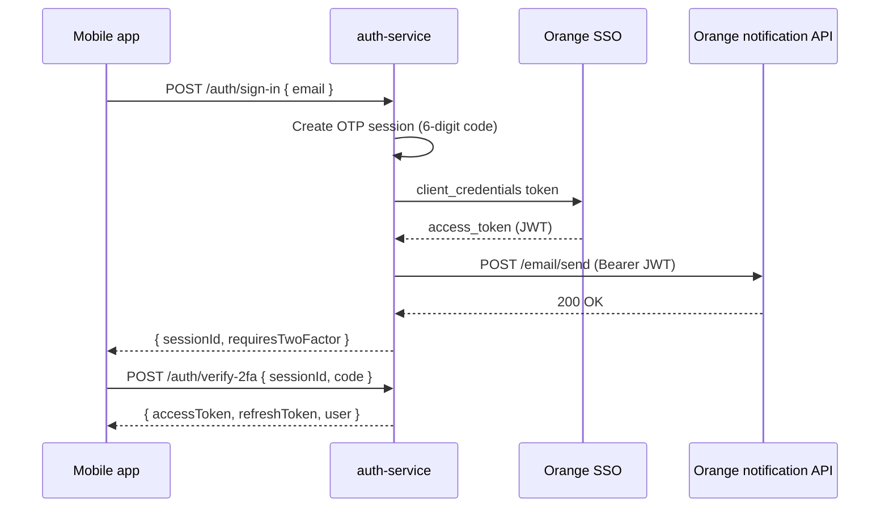

# Orange OTP integration (VPN / preprod)

MyBoss sends login OTP emails through Orange enterprise APIs. **All Orange calls run in `auth-service` only** — the mobile app continues to use `POST /auth/sign-in` and `POST /auth/verify-2fa`.

## Flow



## Enable Orange OTP

In `myboss-platform/.env` (or Docker env for `auth-service`):

```env
OTP_PROVIDER=orange
TWO_FA_DEMO_ENABLED=false

ORANGE_SSO_TOKEN_URL=https://xpapis.orange.jo/sso/realms/v1/dev/sso/protocol/openid-connect/token
ORANGE_SSO_CLIENT_ID=apigee-app
ORANGE_SSO_CLIENT_SECRET=<from Orange support>

ORANGE_EMAIL_API_URL=http://preprod-notification.xyz.jt.jtgroup/email/send
ORANGE_EMAIL_CLIENT_NAME=sajelni
ORANGE_EMAIL_CHANNEL=survey_app
ORANGE_EMAIL_TYPE=blank
# ORANGE_EMAIL_API_KEY=<when Apigee provides apiKey for survey_app>
```

Restart auth-service after changing env:

```bash
cd myboss-platform/docker
docker compose -f docker-compose.demo.yml up -d --build auth-service
```

## VPN testing

1. Connect the **host running Docker** (or your dev machine) to the Orange VPN so `auth-service` can reach SSO and the preprod notification API.
2. Install the mobile app on a VPN-connected test device pointing at your demo gateway URL.
3. Sign in with an eligible `@orange.com` email — OTP is emailed via Orange (no `demoOtpCode` in API responses).
4. Check `auth-service` logs for `Orange SSO access token acquired` and `OTP email dispatched`.

If SSO or email calls fail, the API returns `AUTH_OTP_SEND_FAILED` (502).

## Demo mode (local / no VPN)

Keep defaults:

```env
OTP_PROVIDER=demo
TWO_FA_DEMO_ENABLED=true
```

OTP codes are logged in auth-service and optionally returned as `demoOtpCode` in sign-in responses.

## Security notes

- Never put SSO client secret or Orange URLs in the mobile app or admin portal.
- Rotate `ORANGE_SSO_CLIENT_SECRET` via Orange; update `.env` only on the server.
- Disable `TWO_FA_DEMO_ENABLED` whenever `OTP_PROVIDER=orange`.
