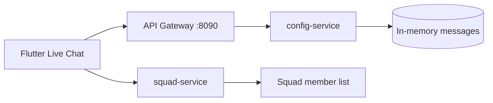

# my boss app — Chat API

> **Service:** config-service (port 3003)  
> **Gateway path:** `/config/api/v1/chat/*`  
> **Swagger:** http://127.0.0.1:8090/config/api/v1/docs (tag: **Chat**)

## Overview

my boss app demo uses **native in-app direct messaging** between squad teammates. Messages are stored in-memory for the event week (suitable for ~1,500 users/day). There is no third-party chat widget in the mobile app UI — the Flutter app renders messages natively and polls the REST API.

| Capability | Implementation |
|---|---|
| Squad teammate chat | `GET/POST /chat/messages` — JWT required |
| Visitor identity | `GET /chat/visitor` — JWT required |
| Bootstrap config | `GET /chat/config` — public |
| Health / monitoring | `GET /chat/health` — public |
| Mobile gating | Chat FAB hidden when user has **no active squad**; contacts = squad members only |

## Architecture



1. User opens **Live Chat** → app loads squad via squad-service.
2. Contact dropdown lists **squad members only** (excluding self).
3. Selecting a contact opens `NativeChatView` which polls `GET /chat/messages?peerId=`.
4. Sending uses `POST /chat/messages` with `{ recipientId, text }`.

## Authentication classification

| Endpoint | Auth | Orange governance |
|---|---|---|
| `GET /chat/config` | **Public** | Apigee: no JWT verify |
| `GET /chat/health` | **Public** | Apigee: monitoring |
| `GET /chat/visitor` | **JWT** | Apigee: verify JWT |
| `GET /chat/messages` | **JWT** | Apigee: verify JWT |
| `POST /chat/messages` | **JWT** | Apigee: verify JWT |

All authenticated calls require:

```http
Authorization: Bearer {accessToken}
Accept-Language: en
```

## Endpoints

### GET `/chat/config` (public)

Returns chat bootstrap metadata for the mobile app and Apigee documentation.

**Response 200:**

```json
{
  "enabled": true,
  "provider": "native",
  "propertyId": "demo",
  "widgetId": "demo",
  "apigeeBasePath": "/config/api/v1/chat",
  "event": {
    "durationDays": 7,
    "dailyUsers": 1500,
    "freeTier": true
  }
}
```

> `propertyId` / `widgetId` are legacy field names kept for Apigee compatibility; provider is always `native` in the current demo.

---

### GET `/chat/health` (public)

**Response 200:**

```json
{
  "status": "ok",
  "provider": "native",
  "enabled": true,
  "capacity": { "durationDays": 7, "dailyUsers": 1500, "freeTier": true }
}
```

---

### GET `/chat/visitor` (JWT)

Returns the authenticated user's chat identity (derived from JWT).

**Response 200:**

```json
{
  "userId": "4",
  "email": "demo@orange.com",
  "name": "demo"
}
```

**Errors (Orange format):**

| HTTP | Code | Reason |
|---|---|---|
| 401 | 40 | Missing credentials |
| 401 | 42 | Expired credentials |

---

### GET `/chat/messages` (JWT)

List messages in a **direct conversation** with one peer.

**Query parameters:**

| Param | Required | Description |
|---|---|---|
| `peerId` | Yes | Recipient user ID or `support` |
| `since` | No | ISO timestamp — return messages after this time (polling) |

**Example:**

```http
GET /config/api/v1/chat/messages?peerId=1&since=2026-07-27T10:00:00.000Z
Authorization: Bearer eyJ...
```

**Response 200:** array of messages

```json
[
  {
    "id": "uuid",
    "conversationId": "dm:1:4",
    "senderId": "4",
    "recipientId": "1",
    "senderName": "demo",
    "text": "Hello teammate",
    "createdAt": "2026-07-27T13:00:00.000Z"
  }
]
```

**Conversation ID rules:**

| Peer | conversationId |
|---|---|
| Squad member | `dm:{sortedUserIdA}:{sortedUserIdB}` |
| Support | `support:{userId}` |

---

### POST `/chat/messages` (JWT)

Send a direct message.

**Request body:**

```json
{
  "recipientId": "1",
  "text": "Hello from squad chat"
}
```

| Field | Type | Rules |
|---|---|---|
| `recipientId` | string | Required; cannot equal sender |
| `text` | string | Required; max 2000 chars |

**Response 201/200:** single message object (same shape as list items).

**Demo support auto-reply:** sending to `recipientId: "support"` triggers an automated reply after ~1.2s (for QA smoke tests).

**Errors:**

| HTTP | Code | Reason | When |
|---|---|---|---|
| 400 | 22 | Invalid body | Missing text/recipient |
| 401 | 40/42 | Missing/Expired credentials | No/invalid JWT |

## Mobile integration

| File | Role |
|---|---|
| `lib/features/chat/data/datasources/chat_remote_datasource_impl.dart` | REST client |
| `lib/features/chat/presentation/pages/live_chat_page.dart` | Squad contacts + gating |
| `lib/features/chat/presentation/widgets/native_chat_view.dart` | Poll + send UI |
| `lib/core/network/dio_client.dart` | Uses **config** base URL |

**Dio base URL (demo web):** `{origin}/config/api/v1` → paths `/chat/...`

## Swagger documentation

Interactive docs are generated from NestJS decorators on `ChatController` and `SendChatMessageDto`.

| Environment | Swagger UI |
|---|---|
| Local gateway | http://127.0.0.1:8090/config/api/v1/docs |
| Public tunnel | `https://<tunnel-host>/config/api/v1/docs` (see `demo-public-url.txt` at repo root) |
| Direct service | http://127.0.0.1:3003/api/v1/docs |

In Swagger UI, expand tag **Chat**, click **Authorize**, paste `Bearer {accessToken}` from `POST /auth/verify-2fa`.

## Apigee proxy (future)

All chat routes use the existing **config** proxy — no separate chat proxy needed:

```
https://api-demo.orange.com/config/api/v1/chat/config     → public
https://api-demo.orange.com/config/api/v1/chat/health     → public
https://api-demo.orange.com/config/api/v1/chat/visitor    → JWT verify
https://api-demo.orange.com/config/api/v1/chat/messages   → JWT verify
```

See also: [`docs/architecture/APIGEE_CHAT.md`](../architecture/APIGEE_CHAT.md) and [`docs/deployment/pdf/03_APIGEE_CONNECTION.md`](../deployment/pdf/03_APIGEE_CONNECTION.md).

## Environment variables (config-service)

```env
CHAT_ENABLED=true
TAWK_PROPERTY_ID=demo          # legacy Apigee field names
TAWK_WIDGET_ID=demo
CHAT_EVENT_DAILY_USERS=1500
CHAT_EVENT_DURATION_DAYS=7
CHAT_APIGEE_BASE_PATH=/config/api/v1/chat
JWT_SECRET=...                 # same secret as auth-service
```

## Verification scripts

```bash
# Full mobile + chat smoke (gateway)
./infrastructure/scripts/verify-mobile-api.sh 127.0.0.1 --gateway

# Localhost including send + support reply
./infrastructure/scripts/verify-localhost.sh
```

## Manual curl test

```bash
# 1. Sign in
SIGN=$(curl -s -X POST http://127.0.0.1:8090/auth/api/v1/auth/sign-in \
  -H "Content-Type: application/json" -d '{"email":"demo@orange.com"}')
SESSION=$(echo "$SIGN" | python3 -c "import sys,json; print(json.load(sys.stdin)['sessionId'])")
OTP=$(echo "$SIGN" | python3 -c "import sys,json; print(json.load(sys.stdin).get('demoOtpCode',''))")

# 2. Verify OTP → token
TOKEN=$(curl -s -X POST http://127.0.0.1:8090/auth/api/v1/auth/verify-2fa \
  -H "Content-Type: application/json" \
  -d "{\"sessionId\":\"$SESSION\",\"code\":\"$OTP\"}" \
  | python3 -c "import sys,json; print(json.load(sys.stdin)['accessToken'])")

# 3. Send message to squad member (user id 1 = Nisreen for demo@orange.com)
curl -s -X POST http://127.0.0.1:8090/config/api/v1/chat/messages \
  -H "Authorization: Bearer $TOKEN" \
  -H "Content-Type: application/json" \
  -d '{"recipientId":"1","text":"Hello teammate"}'

# 4. Poll messages
curl -s "http://127.0.0.1:8090/config/api/v1/chat/messages?peerId=1" \
  -H "Authorization: Bearer $TOKEN"
```

## Test accounts

| Account | Squad | Chat |
|---|---|---|
| `demo@orange.com` | Orange Amman Squad | Can message squad members |
| `omar.t@orange.com` | None | Chat locked (no FAB / empty contacts) |

---

*Orange — my boss app — Chat API*
