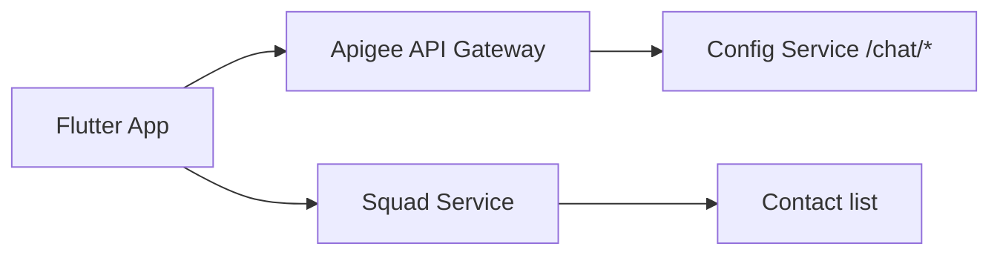

# my boss app — Live Chat (Apigee Integration)

Native squad direct messaging for the **1-week demo event** (~**1,500 users/day**).

## Architecture



| Call | Via Apigee | Auth | Purpose |
|------|------------|------|---------|
| `GET /config/api/v1/chat/config` | Yes | Public | Chat bootstrap metadata |
| `GET /config/api/v1/chat/health` | Yes | Public | Monitoring |
| `GET /config/api/v1/chat/visitor` | Yes | JWT | Authenticated user identity |
| `GET /config/api/v1/chat/messages` | Yes | JWT | Poll direct messages |
| `POST /config/api/v1/chat/messages` | Yes | JWT | Send direct message |

> The mobile app uses **native REST messaging** (no external chat CDN). All chat traffic goes through the **config** Apigee proxy.

Full API reference: [`docs/api/CHAT_API.md`](../api/CHAT_API.md)

## Apigee proxy routes

Use the existing **config** proxy (no separate chat proxy):

| Proxy path | Target |
|------------|--------|
| `/config/api/v1/chat/config` | `config-service` → `/api/v1/chat/config` |
| `/config/api/v1/chat/health` | `config-service` → `/api/v1/chat/health` |
| `/config/api/v1/chat/visitor` | `config-service` → `/api/v1/chat/visitor` |
| `/config/api/v1/chat/messages` | `config-service` → `/api/v1/chat/messages` |

### Recommended policies

**Public routes** (`/chat/config`, `/chat/health`):
- Spike arrest / rate limit: 100 req/min per IP
- CORS for admin portal origin

**JWT routes** (`/chat/visitor`, `/chat/messages`):
1. **Verify JWT** (same secret as auth-service)
2. **Rate limit**: 30 req/min per IP (polling-friendly)
3. **CORS**: allow mobile web `/app/` origin

## Environment variables (config-service)

```env
CHAT_ENABLED=true
TAWK_PROPERTY_ID=demo
TAWK_WIDGET_ID=demo
CHAT_EVENT_DAILY_USERS=1500
CHAT_EVENT_DURATION_DAYS=7
CHAT_APIGEE_BASE_PATH=/config/api/v1/chat
JWT_SECRET=<same-as-auth-service>
```

## Mobile behaviour

1. Employee must be in an **active squad** to use chat.
2. **Live Chat** FAB opens contact picker (squad members only).
3. App polls `GET /chat/messages?peerId=` every few seconds.
4. Sending uses `POST /chat/messages`.

## Swagger

Document and test chat endpoints in Config Service Swagger:

- Local: http://127.0.0.1:8090/config/api/v1/docs
- Apigee (future): `https://api-demo.orange.com/config/api/v1/docs`

## Cost

- **Backend**: in-memory store — negligible for 1-week event
- **Apigee**: uses existing config proxy — no extra product

---

*Orange — my boss app — Chat / Apigee*
