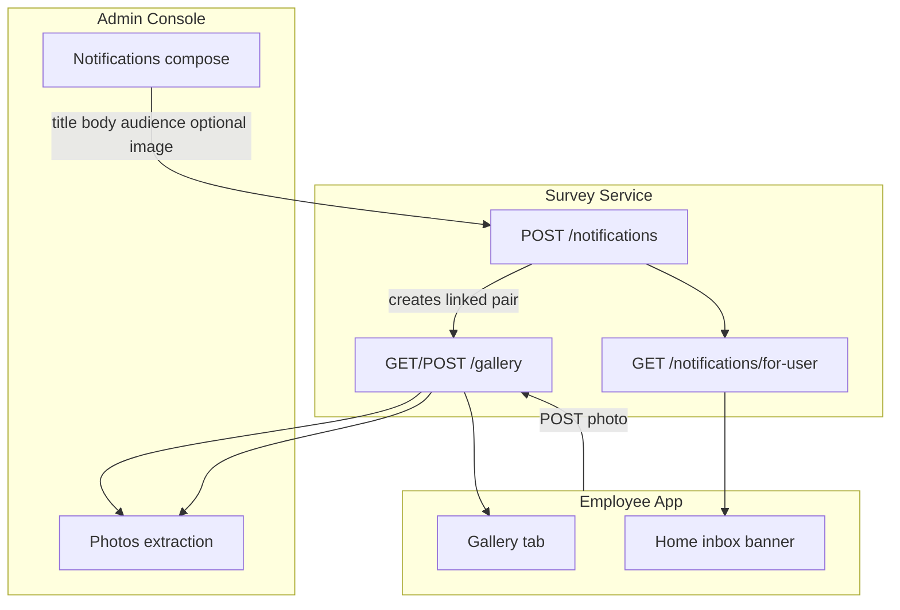

# Gallery ↔ Notifications — unified design

Aligned with:

- Admin HTML V2 (`Notifications` + `Photos` sections)
- Employee HTML (`Gallery` tab — grid of posts + admin broadcasts)
- Journey PDF Rev 1.0 (admin push + field photo collection)

## Concept

One **feed** in survey-service; two surfaces:

| Surface | Who | What they see |
|---------|-----|----------------|
| **Gallery** (employee app) | Employees | Squad photos/videos **+** admin announcement cards |
| **Photos** (admin) | Admins | All media — employee uploads for extraction |
| **Notifications** (admin compose) | Admins | Push form → creates inbox entry **and** gallery card |
| **Inbox** (employee home/gallery) | Employees | Unread badges + announcement cards |

## Data model (demo → production)

### `gallery_items`

| Column | Type | Notes |
|--------|------|-------|
| id | UUID | PK |
| source | ENUM | `employee`, `admin` |
| type | ENUM | `image`, `video`, `announcement` |
| user_id | UUID | Employee uploader; `admin` for broadcasts |
| squad_id | UUID | Employee squad; `broadcast` for admin |
| governorate | VARCHAR | Album grouping |
| url | TEXT | Media URL or optional hero image for announcement |
| title | VARCHAR | Admin notification title (announcements) |
| caption | TEXT | Body text / employee caption |
| audience | VARCHAR | Admin audience segment (admin items only) |
| notification_id | UUID | FK → notifications.id |
| created_at | TIMESTAMPTZ | |

### `notifications`

| Column | Type | Notes |
|--------|------|-------|
| id | UUID | PK |
| title | VARCHAR | Push title |
| body | TEXT | Push body |
| audience | ENUM | All employees / Squad leaders / Travel-eligible / Unregistered |
| gallery_item_id | UUID | FK → gallery_items |
| read_by | UUID[] | User IDs (demo: in-memory array) |
| created_at | TIMESTAMPTZ | |

**Rule:** Every admin notification **must** create exactly one `gallery_items` row with `type=announcement` and matching `notification_id`.

Employee uploads create `gallery_items` with `source=employee`, `type=image|video` — visible in admin **Photos** immediately.

## API (survey-service)

| Method | Path | Auth | Purpose |
|--------|------|------|---------|
| POST | `/notifications` | ADMIN | Compose push → gallery + inbox |
| GET | `/notifications/history` | ADMIN | Sent history (admin page) |
| GET | `/notifications/for-user` | JWT | Inbox for employee (query: profile flags) |
| POST | `/notifications/:id/read` | JWT | Mark read |
| GET | `/gallery` | JWT | All items (announcements + media) |
| POST | `/gallery` | JWT | Employee upload |

### Audience matching (`GET /notifications/for-user`)

Query params from mobile session:

- `userId`, `onboardingCompleted`, `openToTravel`, `isLeader`

| Audience | Match rule |
|----------|------------|
| All employees | always |
| Squad leaders | `isLeader=true` |
| Travel-eligible squads | `openToTravel=true` |
| Unregistered employees | `onboardingCompleted=false` |

## UI behaviour

### Admin — Notifications (HTML V2)

- Compose title + body + audience segment
- Optional image URL (hero for gallery card)
- Send → API → appears in Sent history
- Same item appears in employee Gallery as orange **announcement** card

### Admin — Photos (HTML V2)

- Grid of **employee** uploads (`source=employee`)
- Admin announcements excluded from ZIP extract (or filtered toggle)
- Governate filter unchanged

### Employee — Gallery (HTML mockup)

- Announcement cards at top (Boss logo, title, body, optional image)
- Employee photo/video posts below
- Upload still requires squad (unchanged)
- Browse allowed without squad (unchanged)

### Employee — Home

- Banner when unread notifications exist (links to Gallery)

## Demo vs production

| Concern | Demo | Production |
|---------|------|------------|
| Push delivery | Gallery + inbox only | FCM/APNs + gallery |
| Media storage | Base64 / URL string | S3 + CDN |
| Audience resolution | Query flags from mobile | Server-side user profile join |
| Persistence | JSON file + memory | PostgreSQL |

## Related docs

- [DATA_MODEL.md](./DATA_MODEL.md)
- [NOTIFICATIONS_PRODUCTION.md](./NOTIFICATIONS_PRODUCTION.md) — FCM/APNs options, scale, cost
- [ADMIN_JOURNEY_COVERAGE.md](../ADMIN_JOURNEY_COVERAGE.md)
