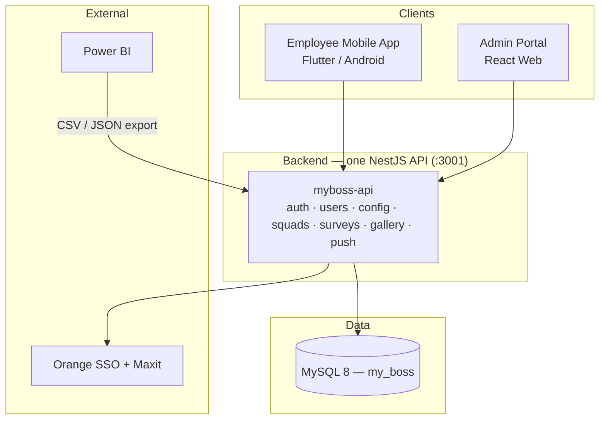
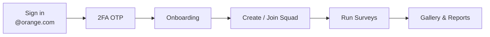
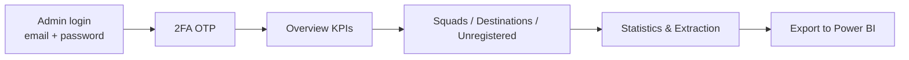
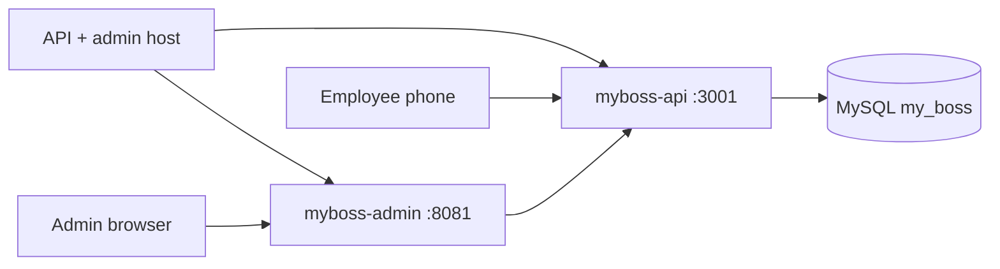

# my boss app — High-Level Design (HLD)

Simple overall view of the system.

---

## 1. What is it?

**my boss app** is an Orange employee initiative platform. Employees form **squads**, run field activities, collect **surveys**, and upload photos. **Admins** manage users, settings, surveys, and export reports to **Power BI**.

---

## 2. Big picture



Runtime: **one employee API** (`myboss-api` :3001) and **one admin UI** (`myboss-admin` :8081). Stages: [`../deployment/STAGES.md`](../deployment/STAGES.md).

---

## 3. Main parts

| Layer | Technology | Who uses it |
|-------|------------|-------------|
| **Mobile app** | Flutter (Android) | Employees |
| **Admin portal** | React + Vite | Admins |
| **Backend** | One NestJS process (`myboss-api`) | Both apps |
| **Database** | MySQL 8 — `my_boss` on `10.1.165.105:3308` for development and production; dedicated DB for preprod (staging) | API |
| **Analytics** | CSV/JSON export APIs | Power BI / Admin |

---

## 4. Backend modules (one process)

| Module | Main job |
|--------|----------|
| **Auth** | Login, 2FA OTP, JWT tokens |
| **Users** | Employee profiles and accounts |
| **Config** | Squad limits, buildings, app settings, live chat |
| **Squads** | Create/join squads, members, leaders, invitations (pending invites reserve seats) |
| **Surveys** | Surveys, responses, gallery, notifications, reports, Power BI export |
| **Push** | FCM dispatch |

---

## 5. MySQL — what is stored

All stages use **one database** (`MYSQL_DATABASE=my_boss` on `10.1.165.105:3308`). See [`../database/DATABASE.md`](../database/DATABASE.md).

| Domain | Examples |
|--------|----------|
| **Auth & users** | Single `users` table (eligibility + profile), OTP sessions |
| **Config** | Buildings, app settings, squad limits |
| **Squads** | Squads, members, join requests and invitations (deleted when the user joins) |
| **Surveys** | Survey schemas, responses, gallery, notifications, analytics |

`DB_ENABLED=true` and `DB_SYNCHRONIZE=false` on the shared corporate DB.

---

## 6. Employee flow (Mobile)



**Main screens:** Sign in → OTP → Home → My Squad → Surveys → Gallery → Profile

---

## 7. Admin flow (Web)



**Main sections:** Overview · Statistics · Squads · Destinations · Unregistered · Notifications · Extraction · Surveys · Photos · Vests · Audit

**Entry URL:** `http://<DEMO_HOST>:8081/login`

---

## 8. Survey data flow

```mermaid
sequenceDiagram
    participant E as Employee App
    participant A as myboss-api :3001
    participant D as MySQL (my_boss)
    participant P as Power BI

    E->>A: GET /surveys/catalog + /surveys/active/:segment (online Home)
    Note over E: Cache schemas + last squad on device
    E->>E: Open / fill service offline; close saves draft
    E->>A: POST /responses (online, or flush queued draft)
    A->>D: Save response
    A->>D: Read aggregated data
    A->>P: CSV / JSON export
```

---

## 9. Security (high level)

| Role | Authentication |
|------|----------------|
| **Employee** | `@orange.com` email + OTP |
| **Admin** | Email + password + OTP |
| **API** | JWT bearer token on requests |

OTP: development and production use **production Maxit** (`10.4.3.27`). Preprod uses preprod SSO/email APIs. Same MySQL for all three.

---

## 10. Deployment view



---

## 11. One-line summary

> **Flutter employee app + React admin portal + one NestJS API + shared MySQL (`my_boss`)**, centered on **squads, dynamic surveys, and Power BI-ready analytics**.

---

## Related docs

- [ARCHITECTURE.md](./ARCHITECTURE.md) — detailed architecture
- [../deployment/STAGES.md](../deployment/STAGES.md) — development / preprod / production
- [../deployment/](../deployment/) — deployment guides
