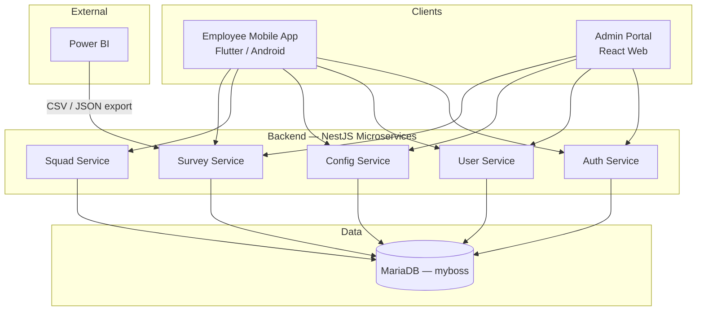
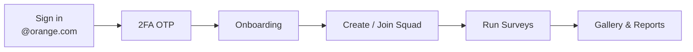
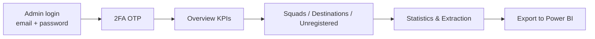
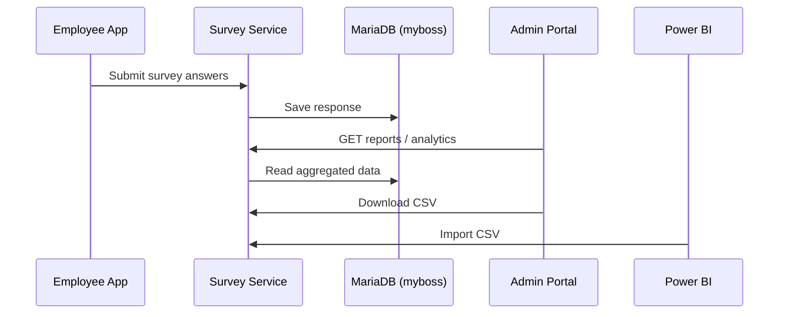
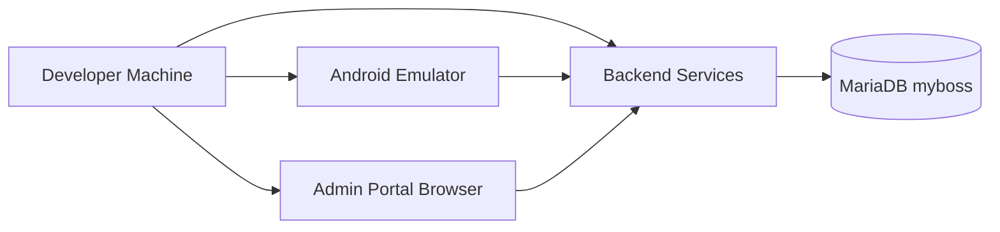

# my boss app — High-Level Design (HLD)

Simple overall view of the system.

---

## 1. What is it?

**my boss app** is an Orange employee initiative platform. Employees form **squads**, run field activities, collect **surveys**, and upload photos. **Admins** manage users, settings, surveys, and export reports to **Power BI**.

---

## 2. Big picture

---

## 3. Main parts

| Layer | Technology | Who uses it |
|-------|------------|-------------|
| **Mobile app** | Flutter (Android) | Employees |
| **Admin portal** | React + Vite | Admins |
| **Backend** | NestJS (5 microservices) | Both apps |
| **Database** | MariaDB 11 — single shared `myboss` database | All backend services |
| **Analytics** | CSV/JSON export APIs | Power BI / Admin |

---

## 4. Backend services

| Service | Main job |
|---------|----------|
| **Auth** | Login, 2FA OTP, JWT tokens |
| **User** | Employee profiles and accounts |
| **Config** | Squad limits, buildings, app settings, **live chat config (Apigee)** |
| **Squad** | Create/join squads, members, leaders |
| **Survey** | Surveys, responses, gallery, notifications, reports, Power BI export |

---

## 5. MariaDB — what is stored

All microservices connect to **one database** (`MARIADB_DATABASE=myboss`). No duplicate user or squad snapshot columns — see [`../database/DATABASE.md`](../database/DATABASE.md).

| Domain | Examples |
|--------|----------|
| **Auth & users** | Single `users` table (eligibility + profile), OTP sessions |
| **Config** | Buildings, app settings, squad limits |
| **Squads** | Squads, members, join requests |
| **Surveys** | Survey schemas, responses, gallery, notifications, analytics |

> **Note:** Demo defaults to in-memory data (`DB_ENABLED=false`). Enable MariaDB with `DB_ENABLED=true` for persistent, report-ready data.

---

## 6. Employee flow (Mobile)

**Main screens:** Sign in → OTP → Home → My Squad → Surveys → Gallery → Profile

---

## 7. Admin flow (Web — V2 Console)

**Main sections (V2):** Overview · Statistics · Squads · Destinations · Unregistered · Notifications · Extraction · Surveys · Photos · Vests · Audit

**Entry URL:** `http://<gateway>:8090/login` or public tunnel `/login`

---

## 8. Survey data flow

---

## 9. Security (high level)

| Role | Authentication |
|------|----------------|
| **Employee** | `@orange.com` email + OTP |
| **Admin** | Email + password + OTP |
| **API** | JWT bearer token on requests |

---

## 10. Deployment view (development)

---

## 11. One-line summary

> **Flutter mobile app for employees + React admin portal + NestJS microservices + MariaDB (`myboss`)**, centered on **squads, dynamic surveys, and Power BI-ready analytics**.

---

## Related docs

- [ARCHITECTURE.md](./ARCHITECTURE.md) — detailed architecture
- [../deployment/](../deployment/) — deployment guides
