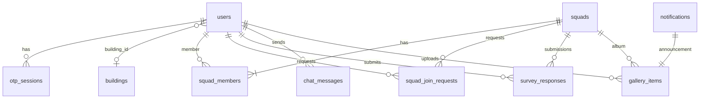

# Database Schema

**Audience:** Backend developers, DBAs, architects  
**Status:** Demo defaults to **in-memory** (`DB_ENABLED=false`). **MariaDB 11** with a **single shared database** (`myboss`) — all microservices connect to the same DB. Enable with `DB_ENABLED=true`.

This document describes the unified MariaDB schema aligned with the employee journey (Rev 1.0, July 2026).

For API-level auth and roles, see [`../security/SECURITY.md`](../security/SECURITY.md) and [`../architecture/GOVERNANCE.md`](../architecture/GOVERNANCE.md).

---

## 1. Design principles

1. **One database** — All services use `MARIADB_DATABASE=myboss` (no database-per-service).
2. **Single source of truth** — No duplicated user, building, or squad snapshot columns.
3. **Real foreign keys** — Cross-table integrity enforced in MariaDB (not logical FKs only).
4. **Eligibility + profile unified** — `users` table replaces separate `eligible_participants` + `user_profiles`.
5. **Squad membership authoritative** — `squad_members` is the only place squad assignment is stored; API `squadId` is derived at read time.
6. **OTP sessions ephemeral** — Hashed codes + expiry + attempt counter in `otp_sessions`.

---

## 2. Architecture

| Layer | Detail |
|-------|--------|
| **Database** | `myboss` (one MariaDB database) |
| **Connection** | `MARIADB_HOST`, `MARIADB_PORT`, `MARIADB_USER`, `MARIADB_PASSWORD`, `MARIADB_DATABASE=myboss` |
| **Services** | auth, user, config, squad, survey — each registers only its own TypeORM entities against the same DB |
| **DDL reference** | `docker/mariadb/init/02-schema-reference.sql` |

### Service → table ownership (logical, same DB)

| Service | Primary tables |
|---------|----------------|
| **auth-service** | `users` (eligibility), `otp_sessions` |
| **user-service** | `users` (profile), `device_tokens` |
| **config-service** | `buildings`, `app_config`, `chat_messages` |
| **squad-service** | `squads`, `squad_members`, `squad_join_requests` |
| **survey-service** | `surveys`, `survey_responses`, `gallery_items`, `notifications` |

---

## 3. Duplicates removed (vs old multi-DB design)

| Old duplication | Unified approach |
|-----------------|------------------|
| `eligible_participants` + `user_profiles` (same email/name twice) | Single `users` table |
| `user_profiles.building_name`, `governorate` | Join `buildings` via `building_id` FK |
| `user_profiles.squad_id` | Read from `squad_members` (no denormalized copy) |
| `squad_members.first_name`, `last_name`, `building`, `open_to_travel` | Join `users` + `buildings` at read time |
| `squad_join_requests` name/building snapshots | Join `users` at read time |
| `survey_responses.governorate` | Derive from user → building or squad |
| `gallery_items.governorate` | Derive from squad or user |

---

## 4. Entity relationship



---

## 5. Core tables

### `users` (replaces eligible_participants + user_profiles)

| Column | Type | Notes |
|--------|------|-------|
| id | UUID | PK — same id across auth and profile |
| email | VARCHAR | UNIQUE — sign-in gate + profile |
| first_name, last_name | VARCHAR | |
| role | VARCHAR | `employee`, `admin`, `super_admin` |
| invited_at | DATETIME | Mass invitation tracking |
| is_active | BOOLEAN | Eligibility gate (auth checks this) |
| onboarding_completed | BOOLEAN | |
| terms_accepted_at | DATETIME | |
| vest_size | VARCHAR | |
| building_id | UUID | FK → buildings |
| open_to_travel | BOOLEAN | |
| preferred_governorates | JSON | |
| profile_edit_count | SMALLINT | Max 3 edits |

**Not stored:** `building_name`, `governorate`, `squad_id` — joined/derived at read time.

### `otp_sessions`

| Column | Type | Notes |
|--------|------|-------|
| user_id | UUID | FK → users (was participant_id) |
| code_hash | VARCHAR | bcrypt/argon2 |
| expires_at | DATETIME | Default 10 minutes |
| attempts | SMALLINT | Lock after 5 failures |

### `squad_members`

| Column | Type | Notes |
|--------|------|-------|
| squad_id | UUID | PK composite, FK → squads |
| user_id | UUID | PK composite, FK → users |
| role | ENUM | `leader`, `member` |

### `chat_messages`

| Column | Type | Notes |
|--------|------|-------|
| `id` | UUID | PK |
| `conversation_id` | VARCHAR(80) | e.g. `dm:userA:userB` or `support:userId` |
| `sender_id` | UUID | FK → `users` (includes system user `support`) |
| `recipient_id` | UUID | FK → `users` |
| `text` | VARCHAR(2000) | Message body |
| `created_at` | DATETIME | |

**Not stored:** `senderName` — joined from `users` at read time.

### Other tables

See `docker/mariadb/init/02-schema-reference.sql` for `buildings`, `squads`, `squad_join_requests`, `surveys`, `survey_responses`, `gallery_items`, `notifications`, `device_tokens`, `app_config`.

---

## 6. Local setup

```bash
cd myboss-platform/docker
docker compose up -d mariadb redis
```

In `.env`:

```
DB_ENABLED=true
MARIADB_HOST=localhost
MARIADB_PORT=3306
MARIADB_DATABASE=myboss
MARIADB_USER=myboss
MARIADB_PASSWORD=changeme
```

**Demo + MariaDB:**

```bash
docker compose -f docker/docker-compose.demo.yml --profile with-mariadb up -d --build
```

---

## 7. Demo vs production

| Area | Demo today | With DB enabled |
|------|------------|-----------------|
| Storage | In-memory per service | Single `myboss` database |
| User eligibility + profile | Separate in-memory arrays | Single `users` row |
| Squad assignment | Denormalized `squadId` on profile (in-memory) | `squad_members` table only |
| OTP | In-memory plaintext | `otp_sessions` with hashed codes |
| Cross-service sync | HTTP + service token | Same DB — optional HTTP kept for demo compat |

---

## 8. Demo seed accounts

Shared demo identifiers live in `myboss-backend/libs/common/src/demo/demo-seed.constants.ts` (`DEMO_USER_IDS`, `DEMO_SQUAD_IDS`, `DEMO_BUILDING`, `DEMO_EMAILS`). Auth, user, and squad repositories import these so ids stay aligned.

| Email | User id | Onboarding | Squad | Purpose |
|-------|---------|------------|-------|---------|
| demo@orange.com | `4` | ✓ | Orange Amman Squad | Full happy path |
| omar.t@orange.com | `2` | ✓ | **None** | No-squad gating |
| nisreen.a@orange.com | `1` | ✓ | Orange Amman (leader) | Leader flows |
| laila.m@orange.com | `3` | ✗ | None | Onboarding |
| sara.h@orange.com | `leader-irbid` | ✓ | Orange Irbid (leader) | Join/browse other squads |
| khaled.r@orange.com | `leader-zarqa` | ✓ | Orange Zarqa (leader) | Join/browse other squads |
| admin@orange.com | `admin-1` | ✓ | — | Admin console (auth uses separate demo admin entity) |

### Demo data reset

In-memory state mutates during testing. Restore seed data with:

```bash
./scripts/reset-demo-data.sh
```

(from `myboss-platform`)

| Service | Reset on restart | Notes |
|---------|------------------|-------|
| auth-service | ✅ `AuthRepository.resetDemoSeed()` | Eligible users in `users` when DB enabled |
| user-service | ✅ `UsersRepository.resetDemoSeed()` | Profiles in shared `users` table |
| squad-service | ✅ `SquadsRepository.resetDemoSeed()` | Squads, members, join requests |
| config-service | ❌ | Admin config changes persist until restart |
| survey-service | ⚠️ partial | Survey catalog/responses re-seed on boot; gallery/notifications may persist on disk |

---

## Related documentation

| Document | Purpose |
|----------|---------|
| [`../architecture/GOVERNANCE.md`](../architecture/GOVERNANCE.md) | API errors, roles |
| [`../api/API_OVERVIEW.md`](../api/API_OVERVIEW.md) | REST endpoints |
| [`../devops/DEVOPS.md`](../devops/DEVOPS.md) | Deploy & infrastructure |

---

*Orange — my boss app — Database*
