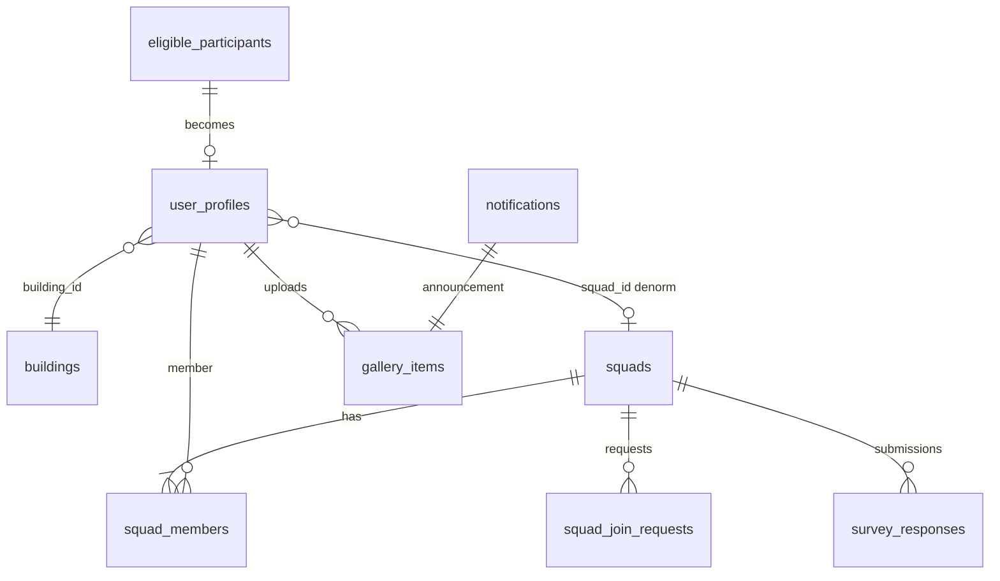

# Database Schema

**Audience:** Backend developers, DBAs, architects  
**Status:** Demo defaults to **in-memory** (`DB_ENABLED=false`). **MariaDB 11** is the team database standard — auth, user, config, and squad services have TypeORM implementations; enable with `DB_ENABLED=true`. Survey service follows the same pattern (in-memory today; schema in `docker/mariadb/init/02-schema-reference.sql`).

This document describes the **target MariaDB schema** aligned with the employee journey (Rev 1.0, July 2026).

For API-level auth and roles, see [`../security/SECURITY.md`](../security/SECURITY.md) and [`../architecture/GOVERNANCE.md`](../architecture/GOVERNANCE.md).

---

## 1. Design principles

1. **Single source of truth** — Squad membership lives in `squads` + `squad_members`. User profile holds denormalized `squad_id` for fast reads.
2. **Eligibility before auth** — `eligible_participants` gates sign-in (`@orange.com` + invitation pool).
3. **OTP sessions are ephemeral** — Never store plaintext OTP; use hashed codes + expiry + attempt counter.
4. **Audit squad changes** — Join requests, accept/reject, leadership transfer, formation lock window.
5. **Service-owned tables** — Each microservice owns its schema; cross-service sync via events or internal API (demo uses HTTP + service token).

---

## 2. Service ownership

| Service | Database (production) | Tables | MariaDB status |
|---------|----------------------|--------|----------------|
| **auth-service** | `myboss_auth` | `eligible_participants`, `otp_sessions` | **Implemented** (TypeORM) |
| **user-service** | `myboss_user` | `user_profiles` | **Implemented** (TypeORM) |
| **config-service** | `myboss_config` | `buildings`, reference config | **Implemented** (TypeORM) |
| **squad-service** | `myboss_squad` | `squads`, `squad_members`, `squad_join_requests` | **Implemented** (TypeORM) |
| **survey-service** | `myboss_survey` | `survey_responses`, `gallery_items`, `notifications`, surveys catalog | Planned (in-memory + JSON files today) |

Demo today: set `DB_ENABLED=false` for in-memory mode, or `DB_ENABLED=true` with MariaDB compose for persistent auth/user data.

**Local MariaDB:** `cd myboss-platform/docker && docker compose up -d mariadb redis`

**Demo + MariaDB:** `docker compose -f docker/docker-compose.demo.yml --profile with-mariadb up -d --build` and set `DB_ENABLED=true` in `.env`.

---

## 3. Entity relationship (overview)



---

## 4. Tables by service

### 4.1 auth-service

#### `eligible_participants`

| Column | Type | Constraints | Notes |
|--------|------|-------------|-------|
| id | UUID | PK | |
| email | VARCHAR | UNIQUE, NOT NULL | Must match allowed domain |
| first_name | VARCHAR | | |
| last_name | VARCHAR | | |
| invited_at | TIMESTAMPTZ | | Mass invitation tracking |
| is_active | BOOLEAN | DEFAULT true | Soft disable |

#### `otp_sessions` (production)

| Column | Type | Constraints | Notes |
|--------|------|-------------|-------|
| id | UUID | PK | |
| participant_id | UUID | FK → eligible_participants | |
| code_hash | VARCHAR | NOT NULL | bcrypt/argon2 of 6-digit code |
| expires_at | TIMESTAMPTZ | NOT NULL | Default 10 minutes |
| attempts | SMALLINT | DEFAULT 0 | Lock after 5 failures |
| created_at | TIMESTAMPTZ | NOT NULL | |

---

### 4.2 user-service

#### `user_profiles`

| Column | Type | Constraints | Notes |
|--------|------|-------------|-------|
| id | UUID | PK | Matches auth participant id |
| email | VARCHAR | UNIQUE, NOT NULL | |
| role | ENUM | NOT NULL | `employee`, `admin`, `super_admin` |
| onboarding_completed | BOOLEAN | DEFAULT false | Vest + building done |
| terms_accepted_at | TIMESTAMPTZ | NULL | Legal acceptance timestamp |
| vest_size | VARCHAR | | |
| building_id | UUID | FK → buildings | |
| governorate | VARCHAR | | Denormalized from building |
| open_to_travel | BOOLEAN | DEFAULT false | |
| preferred_governorates | JSONB | | When open_to_travel |
| squad_id | UUID | NULL, FK → squads | NULL = no squad |
| profile_edit_count | SMALLINT | DEFAULT 0 | Max 3 edits |

**Indexes (production):** `email`, `squad_id`, `role`

---

### 4.3 config-service

#### `buildings`

| Column | Type | Constraints | Notes |
|--------|------|-------------|-------|
| id | UUID | PK | |
| name | VARCHAR | NOT NULL | |
| governorate | VARCHAR | NOT NULL | Read-only in mobile UI |

---

### 4.4 squad-service

#### `squads`

| Column | Type | Constraints | Notes |
|--------|------|-------------|-------|
| id | UUID | PK | |
| squad_code | VARCHAR | UNIQUE | Auto e.g. SQ-0248 |
| name | VARCHAR | UNIQUE | Letters + spaces only |
| badge | VARCHAR | | Emoji/icon |
| governorate | VARCHAR | NOT NULL | |
| leader_id | UUID | FK → user_profiles | |
| survey_target | INT | | From config |
| destination | VARCHAR | NULL | Admin-validated |
| destination_validated | BOOLEAN | DEFAULT false | |
| locked_at | TIMESTAMPTZ | NULL | Post-formation edit window |
| created_at | TIMESTAMPTZ | NOT NULL | |

#### `squad_members`

| Column | Type | Constraints | Notes |
|--------|------|-------------|-------|
| squad_id | UUID | PK (composite) | FK → squads |
| user_id | UUID | PK (composite) | FK → user_profiles |
| role | ENUM | NOT NULL | `leader`, `member` |
| building | VARCHAR | | Snapshot at join |
| open_to_travel | BOOLEAN | | Snapshot at join |

**Rule:** On accept → cancel all other pending join requests for that user.

#### `squad_join_requests`

| Column | Type | Constraints | Notes |
|--------|------|-------------|-------|
| id | UUID | PK | |
| squad_id | UUID | FK → squads | |
| user_id | UUID | FK → user_profiles | |
| status | ENUM | NOT NULL | pending, accepted, rejected, cancelled |
| created_at | TIMESTAMPTZ | NOT NULL | |

---

### 4.5 survey-service

#### `survey_responses`

| Column | Type | Notes |
|--------|------|-------|
| id | UUID | PK |
| survey_id | UUID | FK |
| segment | VARCHAR | consumer / business / employee |
| squad_id | UUID | FK → squads |
| user_id | UUID | FK → user_profiles |
| governorate | VARCHAR | |
| answers | JSONB | Question responses |
| anonymous | BOOLEAN | |
| submitted_at | TIMESTAMPTZ | |

Consent fields (national ID 10 digits, phone +962) per employee journey doc.

#### `gallery_items`

| Column | Type | Notes |
|--------|------|-------|
| id | UUID | PK |
| source | ENUM | `employee`, `admin` |
| type | ENUM | `image`, `video`, `announcement` |
| user_id | UUID | Employee uploader; `admin` for broadcasts |
| squad_id | UUID | Employee squad; `broadcast` for admin |
| governorate | VARCHAR | Album grouping |
| url | TEXT | Media URL or hero for announcement |
| title | VARCHAR | Admin notification title |
| caption | TEXT | Body / employee caption |
| audience | VARCHAR | Admin segment (admin items only) |
| notification_id | UUID | FK → notifications.id |
| created_at | TIMESTAMPTZ | |

#### `notifications`

| Column | Type | Notes |
|--------|------|-------|
| id | UUID | PK |
| title | VARCHAR | Push title |
| body | TEXT | Push body |
| audience | ENUM | All employees / Squad leaders / Travel-eligible / Unregistered |
| gallery_item_id | UUID | FK → gallery_items |
| read_by | UUID[] | User IDs who opened announcement |
| created_at | TIMESTAMPTZ | |

**Rule:** Admin `POST /notifications` creates notification + linked `gallery_items` announcement. Employee `POST /gallery` sets `source=employee`.

See [`../architecture/GALLERY_NOTIFICATIONS.md`](../architecture/GALLERY_NOTIFICATIONS.md).

---

## 5. Cross-service sync

When squad membership changes, squad-service updates user-service:

```
PUT /user/api/v1/users/{userId}/squad
Header: X-Internal-Service-Token: {INTERNAL_SERVICE_TOKEN}
Body: { "squadId": "..." | null }
```

Production target: DB transaction or outbox event instead of synchronous HTTP.

---

## 6. Demo vs production

| Area | Demo today | Production target |
|------|------------|-------------------|
| Storage | In-memory arrays per service | PostgreSQL per service |
| OTP | In-memory + optional demo code in API | Email provider + `otp_sessions` table |
| Squad cap | Config limits in memory | Persisted + enforced in DB |
| Gallery media | Base64 / demo file | Object storage + `gallery_items` metadata |
| User ↔ squad sync | HTTP + service token | Event-driven or shared transaction |
| Admin audit | Minimal | Audit table for admin writes |

---

## 7. Demo seed accounts

Shared demo identifiers live in `myboss-backend/libs/common/src/demo/demo-seed.constants.ts` (`DEMO_USER_IDS`, `DEMO_SQUAD_IDS`, `DEMO_BUILDING`, `DEMO_EMAILS`). Auth, user, and squad repositories import these so ids stay aligned.

| Email | User id | Onboarding | Squad | Purpose |
|-------|---------|------------|-------|---------|
| demo@orange.com | `4` | ✓ | Orange Amman Squad | Full happy path |
| omar.t@orange.com | `2` | ✓ | **None** | No-squad gating |
| nisreen.a@orange.com | `1` | ✓ | Orange Amman (leader) | Leader flows |
| laila.m@orange.com | `3` | ✗ | None | Onboarding |
| sara.h@orange.com | `leader-irbid` | ✓ | Orange Irbid (leader) | Join/browse other squads |
| khaled.r@orange.com | `leader-zarqa` | ✓ | Orange Zarqa (leader) | Join/browse other squads |
| admin@orange.com | `admin-1` | ✓ | — | Admin console (auth uses separate demo admin entity) |

### Demo data reset

In-memory state mutates during testing. Restore seed data with:

```bash
./scripts/reset-demo-data.sh
```

This rebuilds **user-service** (clears `termsAcceptedAt` in seed) and restarts **auth**, **squad**, and **survey** services. Each service restores its in-memory arrays on boot via `resetDemoSeed()` where implemented.

| Service | Reset on restart | Notes |
|---------|------------------|-------|
| auth-service | ✅ `AuthRepository.resetDemoSeed()` | Eligible participants |
| user-service | ✅ `UsersRepository.resetDemoSeed()` | Profiles + denormalized `squadId` |
| squad-service | ✅ `SquadsRepository.resetDemoSeed()` | Squads, members, join requests |
| config-service | ❌ | Admin config changes persist until restart |
| survey-service | ⚠️ partial | Survey catalog/responses re-seed on boot; gallery/notifications may persist on disk |

---

## 8. Local PostgreSQL (optional)

```bash
cd docker
docker compose up -d    # postgres:16-alpine, redis:7-alpine
```

Connection defaults in `.env.example`:

```
POSTGRES_HOST=localhost
POSTGRES_PORT=5432
POSTGRES_USER=myboss
POSTGRES_PASSWORD=changeme
POSTGRES_DB=myboss_dev
```

---

## Related documentation

| Document | Purpose |
|----------|---------|
| [`../architecture/GOVERNANCE.md`](../architecture/GOVERNANCE.md) | API errors, roles |
| [`../api/API_OVERVIEW.md`](../api/API_OVERVIEW.md) | REST endpoints |
| [`../devops/DEVOPS.md`](../devops/DEVOPS.md) | Deploy & infrastructure |

---

*Orange — my boss app — Database*
